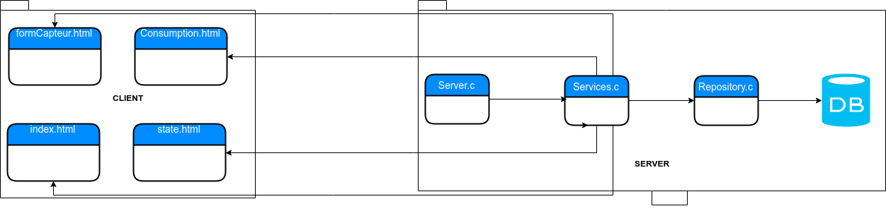

# IOT

The project will address the following tasks:
1. Construction of the database
2. Design of the client / server application allowing data processing
3. Integration of REST APIs to obtain external data (weather, invoices etc.)
4. Design of the corresponding website

### Compiling

In order to compile the server is needed execute the command described as follow:

```
  gcc -o [NAME-OUTPUT] server.c -lpthread -lsqlite3 -lcurl
```

### Solution

The solution is organized in two different folders: client and server. Client contained four html files (one for each view). Instead, server has three files ".c".

1. Server.c
2. Services.c
3. Repository.c




### Running

In order to run the server is needed execute the command described as follow:

```
  ./[NAME-OUTPUT] [PORT]
```
In order to run the client is needed visit the following website on a browser:

```
  http://www.localhost:[SERVER-PORT]
```
### Github link

https://github.com/juandahl/IOT

